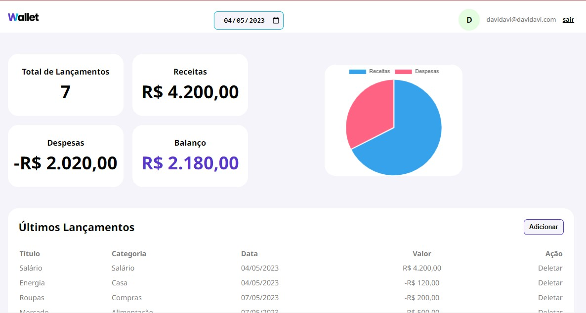

# :chart_with_upwards_trend: Wallet Web Application

This is a web application that helps users manage their personal finances. The application is built with HTML, CSS and JavaScript, and it uses an API to store and retrieve financial and e-mail information.

## :wrench: Features

The application provides the following features:

Login with email  
View monthly balance  
View total revenue and expenses for the month  
Add new entries  
Delete existing entries 
View your balance in a chart

## :crystal_ball: Technologies

The following technologies were used to build this application:

HTML  
CSS  
JavaScript  
API (to store and retrieve financial information)  

## :sunglasses: Usage

To use this application, simply follow these steps:

Clone this repository to your local machine.  
Open index.html in your web browser.  
Log in with your email. (If you don't want to use your e-mail, use davidavi@davidavi.com)  
Use the interface to view your monthly balance and add/delete entries.  

## :computer: Deployment (Live Link)

This application is deployed on GitHub Pages, which means you can access it online, right now! To access the deployed application, simply follow this link: https://davif13.github.io/wallet-app-frontend/

## :thumbsup: Contributing

If you would like to contribute to this project, feel free to submit a pull request. All contributions are welcome!
